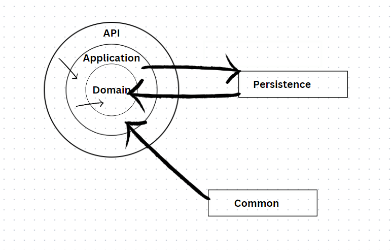

# BookVerse aplikacija
BookVerse je aplikacija koja korisnicima omogućava da se registruju, a potom kreiraju i listaju dogadjaje koji su vezani za svet literature i knjiga. Aplikacija prikazuje učesnike događaja, tako da se svaki ulogovani korisnik može jednostavno prijaviti kao gost, a na isti način i otkazati svoje prisustvo.

## Tehnologije
Prilikom kreiranja aplikacije poštovani su principi ["čiste arhitekture"](https://blog.cleancoder.com/uncle-bob/2012/08/13/the-clean-architecture.html). Od tehnologija, na backendu je korišćena .net platforma. Baza je **SQL** (sqlite s obzirom na to da je reč o radnoj verziji aplikacije, koja bi, pošto si ispoštovani principi čiste arhitekture i slabe zavisnosti između slojeva,  veoma jednostavno mogla da se promeni u bilo koju SQL bazu). Kao objektno-relacioni maper korišćen je **Entity Framework**. 
U aplikaciji je korišćena autorizacija i autentikacija, koja je implementirana pomoću **Identity** framework-a.

Na klijentskoj strani, korišćena je **React** biblioteka, pomoću koje su implementirane komponente. Radi pojednostavljenog prikaza komponenti, korišćena je **Semantic UI** biblioteka. Za prikazivanje formi, korišćena je **Formik** biblioteka. Prilikom upravljanja "stanja" aplikacije, korišćena je **mobx** biblioteka.

## Arhitektura backend-a

Na sledećoj slici, prikazana je arhitektura backend aplikacije koja je implementirana kroz slojeve prateći standarde čiste arhitekture.

Paterni koji su korišćeni na backendu:
 - **CQRS pattern**

Pattern koji odvaja operacije za čitanje i upisivanje podataka. Separacija se postiže korišćenjem komandi za modifikovanje podataka, a upita za čitanje podataka. Pun potencijal i prednost koju nudi ovaj pattern postiže se korišćenjem dvostruke baze podataka. Jedna (često noSQL) koja je optimizovana za čitanje podataka, a druga (najčešće SQL koja je namenjena upisavanju podataka.)
 - **Mediator**
 
Pattern koji omogućava posredništvo prilikom komunikacije između objekata dodavanjem novog sloja, kako bi se onemogućila međusobna zavisnost.
U primeru ove aplikacije, "application" sloj nema zavisnost ka API sloju, već je komunikacija izvedena putem medijatora.

## Arhitektura frontend-a

Frontend aplikacija je realizovana putem komponenti, koje su implementirane react bibliotekom. Pamćenje podataka i stanja biblioteke je odrađeno korišćenjem mobx-a. Važna karakteristika ove biblioteke, zbog koje je dobila prednost u odnosu na druge koje omogućavaju "state management", je odsustvo forsiranja centralnog "store"'-a, u kojoj su smešteni podaci. U BookVerse aplikaciji, postoje dva "store"-a, koji se međusobno dopunjuju, a omogućavaju lakše logičko odvajanje podataka.

### Struktura fajlova
React ne forsira nijedan način strukturisanja fajlova, ali postoje određene preporuke koje je potrebno pratiti radi lakšeg razumevanja projekta i bržeg snalaženja među fajlovima. Na starijoj verziji react dokumentacije, mogu se naći takve preporuke ([link](https://legacy.reactjs.org/docs/faq-structure.html)). U ovoj aplikaciji, korišćena je struktura grupisanja fajlovima prema karakteristikama (***feature-based***)

## Kratki  pregled aplikacije

https://github.com/olivera-mladenovic/BookVerse/assets/45879474/ed385811-b9cc-4737-9ef6-68658a728c26

